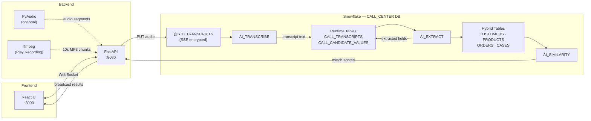
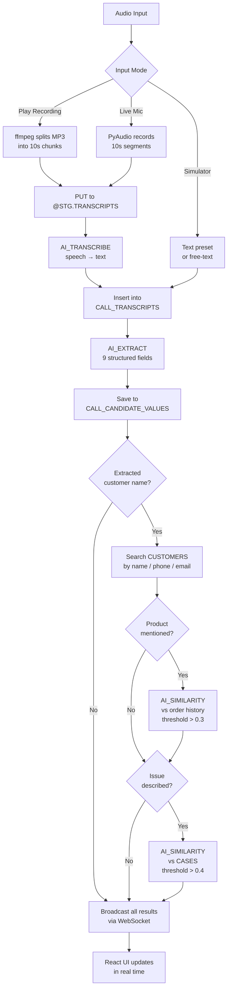
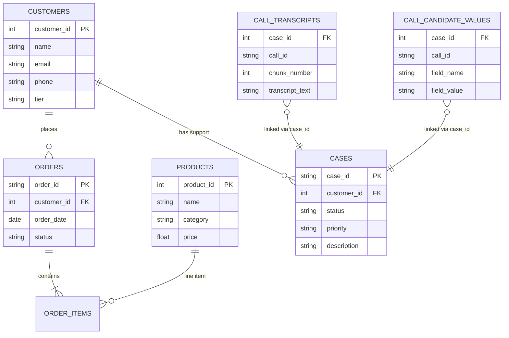

# Call Center AI Demo

Real-time call center assistant powered by Snowflake AI functions. Records (or simulates) live customer conversations, transcribes audio, extracts structured data, identifies customers, matches products from order history, and surfaces similar support cases — all in real time.

## Architecture

### System Overview



### AI Pipeline Flow



### Data Model



All results are broadcast to the React frontend via WebSocket in real time.

## Project Structure

```
voice_demo/
├── sql/                          # Snowflake setup & seed scripts
│   ├── 01_setup.sql              # Database, schemas, stage, hybrid tables
│   ├── 02_seed_data.sql          # Demo data (customers, products, orders, cases)
│   ├── 03_teardown.sql           # Drop everything
│   └── 04_reset_runtime.sql      # Clear transcripts between demo runs
├── backend/
│   ├── main.py                   # FastAPI app, WebSocket, API routes
│   ├── snowflake_ops.py          # All Snowflake queries & AI function calls
│   ├── audio.py                  # Triple-stream PyAudio recorder
│   ├── audio_player.py           # Audio file splitting for Play Recording
│   ├── models.py                 # Pydantic data models
│   ├── assets/
│   │   └── demo_call.mp3         # Pre-recorded demo call (135s, mono MP3)
│   └── requirements.txt          # Python dependencies
└── frontend/
    ├── src/
    │   ├── App.jsx               # Main app — state management & layout
    │   ├── index.js              # React entry point
    │   ├── hooks/
    │   │   └── useWebSocket.js   # Auto-reconnecting WebSocket hook
    │   ├── components/
    │   │   ├── Header.jsx        # Status pills (Backend/Snowflake/Audio/WS)
    │   │   ├── CallSimulator.jsx # Text input + preset buttons
    │   │   ├── CustomerLookup.jsx# Customer details + order history
    │   │   ├── ExtractedInfo.jsx # AI-extracted candidate values grid
    │   │   ├── ProductMatch.jsx  # Matched products with similarity scores
    │   │   ├── SimilarCases.jsx  # Related cases with match percentages
    │   │   └── CallDetails.jsx   # Auto-populated call detail form
    │   └── styles/
    │       └── App.css           # Full application styles
    └── package.json
```

## Prerequisites

- **Snowflake account** with access to AI functions (`AI_EXTRACT`, `AI_SIMILARITY`, `AI_TRANSCRIBE`)
- **Snowflake CLI** (`snowsql`) or Snowsight for running SQL scripts
- **Snowflake connection** configured in `~/.snowflake/config.toml`
- **Python 3.10+**
- **Node.js 18+** and npm
- **ffmpeg** — required for Play Recording mode (`brew install ffmpeg` on macOS)

## Setup

### 1. Snowflake Database

Run the SQL scripts in order using SnowSQL, Snowsight, or any SQL client:

```bash
# Create database, schemas, stage, and all 7 hybrid tables
snowsql -f sql/01_setup.sql

# Populate demo data (8 customers, 10 products, 11 orders, 14 items, 7 cases)
snowsql -f sql/02_seed_data.sql
```

The setup creates:

| Object | Description |
|--------|-------------|
| `CALL_CENTER` database | Top-level container |
| `PUBLIC` schema | Hybrid tables for customers, products, orders, cases |
| `STG` schema | Internal stage for audio files |
| `STG.TRANSCRIPTS` stage | SSE-encrypted stage (required for AI functions) |
| `CUSTOMERS` | 8 demo customers (Diana Prince is the primary persona) |
| `PRODUCTS` | 10 products (headphones are the key demo product) |
| `ORDERS` | 11 orders (4 belong to Diana Prince) |
| `ORDER_ITEMS` | 14 line items across all orders |
| `CASES` | 7 support cases (5 headphone defect cases for similarity matching) |
| `CALL_TRANSCRIPTS` | Runtime — stores transcribed audio chunks |
| `CALL_CANDIDATE_VALUES` | Runtime — stores AI-extracted field values |

### 2. Backend

```bash
cd backend

# Create virtual environment and install dependencies
python3 -m venv .venv
source .venv/bin/activate        # macOS/Linux
# .venv\Scripts\activate         # Windows

pip install -r requirements.txt
```

> **Note:** PyAudio is optional. If it fails to install (common on macOS without PortAudio), the app still works using the Call Simulator. Install PortAudio first if you want live mic recording: `brew install portaudio`

### 3. Frontend

```bash
cd frontend
npm install
```

## Running the Demo

### Start the backend

Set `SNOWFLAKE_CONNECTION_NAME` to your connection name from `~/.snowflake/config.toml`:

```bash
cd backend
source .venv/bin/activate

SNOWFLAKE_CONNECTION_NAME=<your_connection> uvicorn main:app --host 0.0.0.0 --port 8080
```

You should see:

```
INFO:     Uvicorn running on http://0.0.0.0:8080
```

Verify with:

```bash
curl http://localhost:8080/api/health
# {"backend":true,"snowflake":true,"audio":false,"call_active":false}
```

### Start the frontend

In a separate terminal:

```bash
cd frontend
npm start
```

Open **http://localhost:3000** in your browser.

### Verify status indicators

The header shows four status pills:
- **Backend** (green) — FastAPI is responding
- **Snowflake** (green) — Database connection is live
- **Audio** (green/red) — PyAudio availability (red is fine for simulator mode)
- **WebSocket** (green) — Real-time connection established

## Running the Demo Scenario

There are two ways to run the demo: **Play Recording** (recommended for presentations) or the **step-by-step preset buttons**.

### Option A: Play Recording (Full Audio Pipeline)

Click the **Play Recording** button to play a pre-recorded 2-minute customer call through the full Snowflake AI pipeline.

**What happens:**
1. The browser plays the audio file so the audience hears the conversation
2. The backend splits the MP3 into 10-second chunks using ffmpeg
3. Each chunk is uploaded to `@CALL_CENTER.STG.TRANSCRIPTS`, transcribed via `AI_TRANSCRIBE`, and fed through the AI pipeline
4. The UI panels populate progressively as the call unfolds — transcript builds up, customer is identified, products matched, and similar cases surface

**Timeline (~10-12 minutes for full pipeline):**
- Audio playback finishes in ~2 minutes
- AI processing continues in the background — each chunk takes 40-60 seconds for the full pipeline (upload → transcribe → extract → match → similarity)
- All 14 chunks process sequentially; panels update in real time as each completes

**End result:**
- Complete transcript of the entire call
- Customer auto-detected: Diana Prince (PLATINUM tier)
- Product matched: Wireless Noise-Canceling Headphones WH-NC100 (95% match)
- Similar cases: 6 found, top match CASE-2026-004 (64%)
- Call Details form fully auto-populated

Click **Stop** at any time to halt processing.

### Option B: Step-by-Step Presets

The built-in demo tells the story of **Diana Prince** calling about a defective pair of wireless noise-canceling headphones. Use the three preset buttons in sequence:

### Step 1: Click **Intro**

> *"Hi, my name is Diana Prince. I'm calling about an issue with a product I purchased recently."*

**What happens:**
- Transcript panel appears with the text
- AI extracts customer name → auto-populates Customer Lookup with Diana Prince's profile
- Customer details show: PLATINUM tier, 4 orders, full contact info

### Step 2: Click **Details**

> *"Yes, I bought some wireless noise-canceling headphones about a month ago. The left ear keeps cutting out..."*

**What happens:**
- Transcript accumulates both messages
- AI extracts product name + issue description + email
- **Product Match** panel appears — headphones matched at ~97% from her order ORD-2026-901
- **Similar Cases** panel lights up — 5-6 other headphone defect cases found (70-75% match)
- Call Details form auto-fills with extracted email and issue

### Step 3: Click **Escalate**

> *"I've tried factory resetting them... I think it's a hardware defect. I'd like a replacement please. My order number was ORD-2026-901."*

**What happens:**
- Full transcript now tells the complete story
- AI extracts order number (ORD-2026-901) and return reason (hardware defect)
- Call Details form fully populated with all extracted fields
- Similar cases panel shows the pattern — a clear left-ear defect trend across multiple customers

## Key Snowflake AI Functions Used

| Function | Purpose | Where Used |
|----------|---------|------------|
| `AI_TRANSCRIBE` | Speech-to-text from staged audio files | Play Recording mode and live audio mode |
| `AI_EXTRACT` | Structured entity extraction from free text | Every transcript chunk → 9 fields extracted |
| `AI_SIMILARITY` | Cosine similarity between text embeddings | Product matching (>0.3) and case matching (>0.4) |

## API Endpoints

| Method | Path | Description |
|--------|------|-------------|
| `GET` | `/api/health` | Health check — backend, Snowflake, audio, call status |
| `POST` | `/api/customers/search` | Search customers by name, phone, or email |
| `POST` | `/api/calls/start` | Start a live audio recording session |
| `POST` | `/api/calls/stop` | Stop the current recording |
| `GET` | `/api/calls/status` | Current call state |
| `POST` | `/api/calls/simulate` | Send text directly into the AI pipeline |
| `POST` | `/api/calls/play` | Play pre-recorded audio through full AI pipeline |
| `WS` | `/ws` | WebSocket for real-time UI updates |

## Maintenance Scripts

```bash
# Reset between demo runs (clears transcripts + candidates, keeps reference data)
snowsql -f sql/04_reset_runtime.sql

# Full teardown (drops the entire CALL_CENTER database)
snowsql -f sql/03_teardown.sql

# Rebuild from scratch
snowsql -f sql/01_setup.sql
snowsql -f sql/02_seed_data.sql
```

## Troubleshooting

| Issue | Fix |
|-------|-----|
| `snowflake: false` in health check | Verify `SNOWFLAKE_CONNECTION_NAME` matches a connection in `~/.snowflake/config.toml` |
| Port 3000 already in use | `lsof -ti:3000 \| xargs kill` then restart frontend |
| Port 8080 already in use | `lsof -ti:8080 \| xargs kill` then restart backend |
| PyAudio install fails | Install PortAudio first: `brew install portaudio` (macOS) or `apt-get install portaudio19-dev` (Linux). Not required for simulator mode. |
| AI functions return empty results | Ensure your Snowflake account has AI function access enabled. Check that the stage uses `SNOWFLAKE_SSE` encryption. |
| WebSocket not connecting | Confirm backend is running on port 8080. Check browser console for connection errors. |
| Slow AI responses | Each preset takes 15-30 seconds for the full pipeline (extract + match + similarity). This is normal — Snowflake AI functions process sequentially. |
| Play Recording does nothing | Ensure ffmpeg is installed: `ffmpeg -version`. Install with `brew install ffmpeg` (macOS). |
| Play Recording stalls mid-way | Check backend logs for Snowflake errors. Run `sql/04_reset_runtime.sql` and try again. Ensure the stage uses `SNOWFLAKE_SSE` encryption. |
