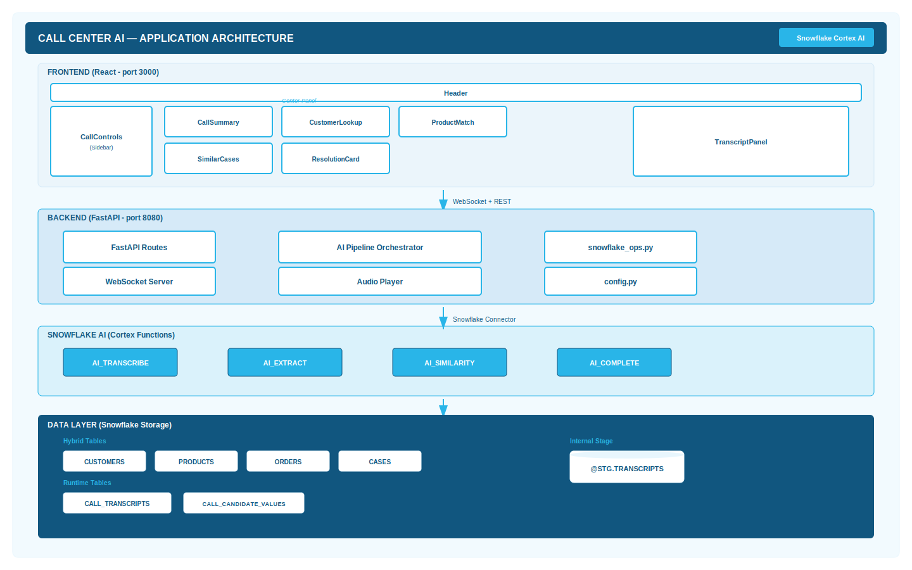

# Call Center AI Demo — Application Architecture

## Layered Architecture

### Layer 1: Presentation (React Frontend — Port 3000)

| Component | File | Description |
|-----------|------|-------------|
| App Shell | `App.jsx` | CSS Grid 3-panel layout. Manages all application state. Subscribes to WebSocket for real-time updates. |
| Header | `Header.jsx` | Compact status bar: call indicator (active/inactive), connection dots (API, Snowflake, WS). |
| CallControls | `CallControls.jsx` | Dark sidebar: recording dropdown, Play/Stop/Reset buttons, playback progress bar, collapsible config. |
| CallSummary | `CallSummary.jsx` | AI_EXTRACT results displayed in 2-column grid. Progressive reveal (null until data). |
| CustomerLookup | `CustomerLookup.jsx` | Customer avatar + profile info grid + scrollable order cards. |
| ProductMatch | `ProductMatch.jsx` | Matched products with circular similarity score badges (color-coded: green > 60%, amber > 45%, red). |
| SimilarCases | `SimilarCases.jsx` | Case cards with status/priority badges, match scores, and resolution text. |
| ResolutionCard | `ResolutionCard.jsx` | AI-recommended resolutions ranked by confidence. Icons map to action types (refund, replace, upgrade, etc.). |
| TranscriptPanel | `TranscriptPanel.jsx` | iMessage-style bubbles. Blue (right) = caller, gray (left) = agent. Consecutive same-speaker bubbles merged via `useMemo`. |
| AnimatedCard | `AnimatedCard.jsx` | Wrapper applying `card-enter` CSS animation once via ref guard (prevents re-trigger on re-render). |
| useWebSocket | `useWebSocket.js` | Hook: auto-reconnect (3s backoff), subscribe callback pattern, connection state tracking. |

### Layer 2: API & Orchestration (FastAPI Backend — Port 8080)

| Component | File | Description |
|-----------|------|-------------|
| FastAPI App | `main.py` | REST endpoints, WebSocket endpoint, call state management, AI pipeline orchestration. |
| Call State | `main.py` | In-memory `current_call` object tracking: call_id, case_id, is_recording, chunk_count. |
| AI Pipeline | `main.py` | `run_ai_pipeline()`: extract → customer match → product match → similar cases → recommendations. |
| Audio Processing | `main.py` | `process_audio_segment()`: upload → transcribe → diarize → broadcast transcript → maybe enrichment. |
| Broadcast | `main.py` | `broadcast()`: sends JSON to all connected WebSocket clients. |

### Layer 3: Data Access (Snowflake Operations)

| Function | File | AI Function | Description |
|----------|------|-------------|-------------|
| `diarize_chunk()` | `snowflake_ops.py` | AI_COMPLETE | Splits transcript chunk by speaker (agent/caller) using structured JSON output. |
| `extract_call_info()` | `snowflake_ops.py` | AI_EXTRACT | Extracts 9 structured fields from transcript text. |
| `match_products()` | `snowflake_ops.py` | AI_SIMILARITY | Matches product mentions against customer's order history. |
| `find_similar_cases()` | `snowflake_ops.py` | AI_SIMILARITY | Finds historically similar support cases. |
| `generate_recommendations()` | `snowflake_ops.py` | AI_COMPLETE | Generates ranked resolution options with confidence scores. |
| `search_customers()` | `snowflake_ops.py` | — | LIKE search on CUSTOMERS by name, phone, email. |
| `get_customer_orders()` | `snowflake_ops.py` | — | Fetches orders + order items for a customer. |
| `transcribe_audio()` | `snowflake_ops.py` | AI_TRANSCRIBE | Transcribes audio file from internal stage. |
| `upload_audio_to_stage()` | `snowflake_ops.py` | — | PUT file to @CALL_CENTER.STG.TRANSCRIPTS. |

### Layer 4: Audio Pipeline

| Component | File | Description |
|-----------|------|-------------|
| Audio Player | `audio_player.py` | Splits MP3 files into 15-second chunks using ffmpeg subprocess. |
| Audio Recorder | `audio.py` | PyAudio live microphone recording (optional — app works without it). |
| Demo Assets | `assets/*.mp3` | Pre-recorded demo calls (Diana Prince headphone defect, Emily Rodriguez shoes). |
| TTS Generator | `scripts/generate_call.sh` | macOS `say` command to generate demo audio from script text. |

### Layer 5: Snowflake Storage

| Object | Type | Schema | Description |
|--------|------|--------|-------------|
| CUSTOMERS | Hybrid Table | PUBLIC | 8 demo customers with loyalty tiers |
| PRODUCTS | Hybrid Table | PUBLIC | 10 products with SKUs and prices |
| ORDERS | Hybrid Table | PUBLIC | 11 orders with status and tracking |
| ORDER_ITEMS | Hybrid Table | PUBLIC | 14 line items linking orders to products |
| CASES | Hybrid Table | PUBLIC | 7 support cases (5 headphone defect pattern) |
| CALL_TRANSCRIPTS | Hybrid Table | PUBLIC | Runtime: transcribed audio chunks |
| CALL_CANDIDATE_VALUES | Hybrid Table | PUBLIC | Runtime: AI-extracted field values |
| TRANSCRIPTS | Internal Stage | STG | SSE-encrypted audio file storage |

## Security Model

| Aspect | Implementation |
|--------|---------------|
| **Snowflake Authentication** | Connection-name based auth via `~/.snowflake/config.toml`. No credentials in code. |
| **Stage Encryption** | `SNOWFLAKE_SSE` encryption on TRANSCRIPTS stage (required for AI functions). |
| **Role** | SYSADMIN role for setup scripts. Application uses connection's default role. |
| **Network** | Backend binds to `0.0.0.0:8080`. Frontend dev server on `localhost:3000`. No TLS in demo mode. |
| **No Authentication** | Demo application — no user auth. Production would require OAuth/SAML. |

## Error Handling

| Layer | Strategy |
|-------|----------|
| **WebSocket** | Auto-reconnect on close (3-second backoff). Connection state tracked and displayed in UI header. |
| **Snowflake Calls** | Try/except in every `snowflake_ops` function. Errors logged, empty results returned (pipeline continues). |
| **AI Pipeline** | Each step independent — failure in product matching doesn't block similar cases or recommendations. |
| **Audio Pipeline** | ffmpeg errors logged. Missing audio chunks skipped without halting the pipeline. |
| **Frontend** | Components return `null` when data is absent. No crash on missing/unexpected WebSocket messages. |
