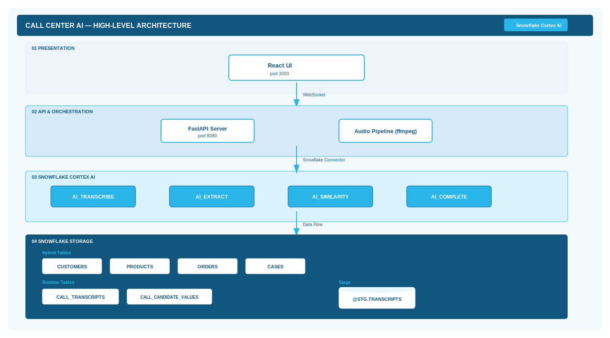

# Call Center AI Demo — Project Overview

## Problem

Contact center agents juggle multiple systems during live calls — CRM lookups, order history, knowledge bases, and case management tools. This context-switching slows resolution times, increases handle time, and degrades the customer experience. Agents often miss critical context (loyalty status, similar case patterns, prior resolutions) that could lead to faster, better outcomes.

## Approach

Build a real-time AI-powered agent assist dashboard that listens to live customer calls (or pre-recorded demos) and progressively surfaces contextual intelligence using Snowflake Cortex AI functions. The system:

- **Transcribes** audio in real time using `AI_TRANSCRIBE`
- **Extracts** structured entities (name, phone, email, product, issue) using `AI_EXTRACT`
- **Diarizes** speaker turns (agent vs. caller) using `AI_COMPLETE` with structured JSON output
- **Matches** mentioned products against order history using `AI_SIMILARITY`
- **Surfaces** similar past support cases using `AI_SIMILARITY`
- **Recommends** resolution options using `AI_COMPLETE` with structured JSON output

All processing happens in Snowflake — no external ML services, no model hosting, no GPU provisioning.

| Technology | Role |
|-----------|------|
| Snowflake Cortex AI | Transcription, entity extraction, similarity matching, LLM completions |
| Snowflake Hybrid Tables | Low-latency OLTP storage for customers, products, orders, cases |
| FastAPI + Python | Backend API, WebSocket server, audio pipeline orchestration |
| React | 3-panel real-time dashboard UI |
| WebSocket | Bidirectional real-time communication |
| ffmpeg | Audio segmentation for demo playback mode |

## Solution

A 3-panel dashboard application with a dark sidebar for call controls, a scrollable center panel for AI-generated intelligence cards, and a right-side transcript panel showing live conversation.

### High-Level Architecture

### Component Summary

| Component | Description |
|-----------|-------------|
| **React Frontend** | 3-panel CSS Grid layout. WebSocket subscription for real-time updates. Progressive card rendering as AI results arrive. |
| **FastAPI Backend** | REST API + WebSocket server. Orchestrates the AI pipeline using `asyncio` with executor-based concurrency for blocking Snowflake calls. |
| **Audio Pipeline** | ffmpeg splits MP3 into 15-second chunks → PUT to stage → AI_TRANSCRIBE → diarization → enrichment pipeline. |
| **Snowflake AI Pipeline** | AI_EXTRACT → customer search → AI_SIMILARITY (products) → AI_SIMILARITY (cases) → AI_COMPLETE (recommendations). |
| **Snowflake Storage** | Hybrid tables for reference data (CUSTOMERS, PRODUCTS, ORDERS, CASES). Runtime tables for transcripts and extracted values. SSE-encrypted stage for audio files. |

### AI Functions Used

| Function | Purpose | Input | Output |
|----------|---------|-------|--------|
| `AI_TRANSCRIBE` | Speech-to-text | Audio file on stage | Transcript text |
| `AI_EXTRACT` | Entity extraction | Transcript text | 9 structured fields (name, phone, email, order, product, issue, resolution, address, return reason) |
| `AI_COMPLETE` | Speaker diarization | Transcript chunk | Speaker-labeled segments |
| `AI_COMPLETE` | Resolution recommendations | Call context (customer tier, issue, product, similar case resolutions) | Ranked resolution options with confidence scores |
| `AI_SIMILARITY` | Product matching | Product mention vs. order history product names | Match scores (threshold > 0.3) |
| `AI_SIMILARITY` | Case matching | Issue description vs. historical case descriptions | Match scores (threshold > 0.4) |

## Expected Outcomes

- **Reduced handle time**: Agents see customer profile, order history, and product details instantly — no manual CRM lookup
- **Faster resolution**: AI-recommended resolution options based on customer tier, issue type, and historical case outcomes
- **Pattern detection**: Similar cases surface automatically, revealing product defect trends (e.g., the WH-NC100 left-ear defect pattern across 5+ customers)
- **Consistent experience**: Every agent gets the same AI-powered intelligence regardless of experience level
- **Demo-ready**: Pre-recorded calls play through the full pipeline for reliable, repeatable demonstrations
