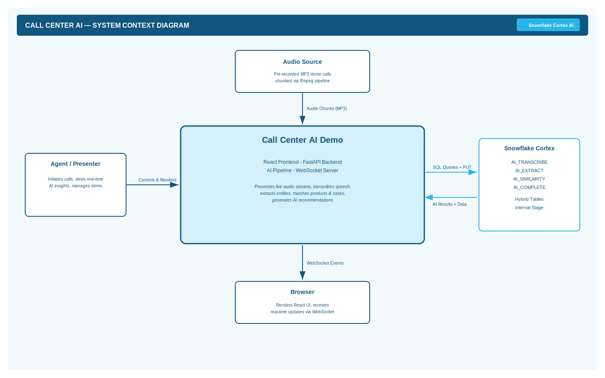

# Call Center AI Demo — Solution Design

## Solution Overview

The system is a real-time agent assist application that augments call center agents by listening to customer conversations and progressively surfacing contextual intelligence. It is designed as a demonstration of Snowflake Cortex AI capabilities in an operational use case.

### Design Rationale

| Decision | Rationale |
|----------|-----------|
| **All AI processing in Snowflake** | Demonstrates Cortex AI functions without external ML infrastructure. Zero model management. |
| **Hybrid Tables for OLTP** | Low-latency point lookups for customer/order/product data during live calls. Index support for search queries. |
| **WebSocket for real-time updates** | Cards appear progressively as AI results arrive — no polling, no page refresh. |
| **Pre-recorded demo mode** | Reliable, repeatable demos without live audio dependencies. ffmpeg splits audio into chunks that simulate real-time streaming. |
| **Subscribe pattern (not queue)** | WebSocket messages dispatched via callback — eliminates race conditions from queue-and-clear patterns. |
| **Progressive card rendering** | Components return `null` until their data arrives. No empty states, no loading spinners — cards animate in when ready. |
| **Structured JSON output from AI_COMPLETE** | `response_format` schema parameter ensures parseable JSON for diarization and recommendations. |

## System Context

### External Actors

| Actor | Interaction |
|-------|------------|
| **Call Center Agent** | Views the dashboard during a live call. Sees customer profile, products, similar cases, and recommended resolutions. |
| **Demo Presenter** | Selects a pre-recorded call and walks through the progressive AI intelligence as it populates. |
| **Snowflake Cortex** | Provides AI_TRANSCRIBE, AI_EXTRACT, AI_SIMILARITY, and AI_COMPLETE functions. |

### System Boundaries

| Boundary | Inside | Outside |
|----------|--------|---------|
| **Application** | FastAPI backend, React frontend, WebSocket communication | Snowflake account, audio hardware, ffmpeg |
| **Data** | Runtime tables (transcripts, candidates), in-memory call state | Reference tables are pre-seeded via SQL scripts |
| **AI Processing** | Pipeline orchestration and result routing | Actual AI inference (runs in Snowflake) |

## Component Breakdown

### Backend Components

| Component | File | Responsibility |
|-----------|------|---------------|
| **FastAPI App** | `main.py` | HTTP routes, WebSocket endpoint, pipeline orchestration, call state management |
| **Snowflake Operations** | `snowflake_ops.py` | All Snowflake queries: search, diarize, extract, match products, find cases, generate recommendations |
| **Audio Player** | `audio_player.py` | ffmpeg-based audio splitting into 15-second chunks |
| **Audio Recorder** | `audio.py` | PyAudio live microphone recording (optional) |
| **Configuration** | `config.py` | Runtime-adjustable settings (segment duration, model, thresholds) |
| **Models** | `models.py` | Pydantic data models for API request/response validation |

### Frontend Components

| Component | File | Responsibility |
|-----------|------|---------------|
| **App** | `App.jsx` | Root component. State management, WebSocket subscription, 3-panel layout. |
| **Header** | `Header.jsx` | Status bar with call indicator and connection status dots (API, Snowflake, WS). |
| **CallControls** | `CallControls.jsx` | Dark sidebar with recording selector, play/stop/reset, collapsible config panel. |
| **CallSummary** | `CallSummary.jsx` | AI_EXTRACT results in a 2-column summary grid. |
| **CustomerLookup** | `CustomerLookup.jsx` | Customer avatar, profile info grid, order history cards. |
| **ProductMatch** | `ProductMatch.jsx` | Matched products with circular similarity score badges. |
| **SimilarCases** | `SimilarCases.jsx` | Historical case cards with status/priority badges and match scores. |
| **ResolutionCard** | `ResolutionCard.jsx` | AI-recommended resolution options with confidence levels and reasoning. |
| **TranscriptPanel** | `TranscriptPanel.jsx` | iMessage-style chat bubbles with speaker labels, call timer, bubble merging. |
| **AnimatedCard** | `AnimatedCard.jsx` | Wrapper that applies CSS entrance animation once (avoids re-trigger on re-render). |
| **useWebSocket** | `useWebSocket.js` | Auto-reconnecting WebSocket hook with subscribe callback pattern. |

## Design Decisions & Trade-offs

| Decision | Trade-off |
|----------|-----------|
| **Sequential AI pipeline** | Each enrichment step depends on the previous (extract → match → recommend). Parallel would be faster but less accurate — product matching needs the extracted product name. |
| **15-second audio chunks** | Shorter chunks = faster first result but more Snowflake calls. Longer chunks = better transcription context but slower feedback. 15s is the balanced default. |
| **llama3.1-8b for diarization** | Smaller model = faster response. Larger models (70b) give better diarization but add latency. Configurable at runtime. |
| **Hybrid Tables (not standard tables)** | Required for low-latency point lookups during live calls. Trade-off: limited to 10B rows, no time travel. Acceptable for demo reference data. |
| **No authentication** | Demo application — simplicity over security. Production would need OAuth/SAML integration. |
| **Client-side state only** | No server-side session persistence. Refreshing the browser resets the UI. Acceptable for demo use case. |

## Non-Functional Requirements

| Requirement | Target | Implementation |
|------------|--------|---------------|
| **Latency** | First AI card within 30s of audio input | Async pipeline with `run_in_executor` for non-blocking Snowflake calls |
| **Reliability** | Auto-recovery from connection drops | WebSocket auto-reconnect with 3s backoff |
| **Scalability** | Single-user demo | Single-process FastAPI, in-memory call state |
| **Portability** | Deploy to any machine with Python 3.10+ and Node 18+ | Docker-free, config-driven Snowflake connection |
| **Observability** | Real-time health checks | `/api/health` endpoint, connection status dots in UI |
